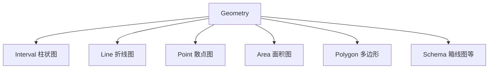

# AntV的实现原理

AntV是蚂蚁金服推出的专业级数据可视化解决方案，其核心在于基于**图形语法**的架构设计。作为一套完整的可视化体系，它包含G2(通用图表)、G6(图分析)、F2(移动端)、L7(地理空间)等多个产品线。下面我将深入解析其核心实现原理：

## 一、核心理论基础：图形语法

AntV的核心理念源自Leland Wilkinson的《The Grammar of Graphics》(图形语法)，将图表分解为多个可组合的语法元素：

```
图表 = 数据 + 变换 + 度量 + 几何标记 + 坐标系 + 视图组合 + 图形属性 + 主题
```

这种设计使得图表创建过程高度模块化，开发者可以通过组合不同语法元素来构建复杂图表。

## 二、架构层次解析

AntV采用分层架构设计，从上到下可分为：

```
+---------------------+
|       API层         |  ← 用户交互界面
+---------------------+
|      语法层         |  ← 图形语法实现
+---------------------+
|     渲染抽象层       |  ← G渲染引擎
+---------------------+
|    设备能力层        |  ← Canvas/SVG/WebGL
+---------------------+
```

### 1. 语法层实现原理

这是AntV最核心的部分，主要包括：

- **Data(数据)**：数据处理管道，支持多种数据格式
- **Scale(度量)**：数据到视觉元素的映射函数
- **Geometry(几何标记)**：定义图表类型(柱状图、折线图等)
- **Coordinate(坐标系)**：坐标系转换(直角坐标、极坐标等)
- **Facet(分面)**：数据分面展示
- **Guide(辅助元素)**：坐标轴、图例、提示框等

**关键实现**：每个语法元素都是独立模块，通过"链式调用"组合：

```javascript
chart
  .interval()          // 几何标记：柱状图
  .position('year*value') // 位置映射：x=year, y=value
  .color('category')   // 颜色映射：根据category字段
  .adjust('stack');    // 数据调整：堆叠
```

### 2. 渲染引擎(G)实现原理

AntV底层使用**G渲染引擎**，这是其高性能的关键：

- **统一渲染接口**：抽象Canvas/SVG/WebGL等不同渲染方式
- **场景图管理**：使用类似于DOM的树形结构管理图形元素
- **渲染管线**：
  1. 构建渲染树
  2. 布局计算
  3. 绘制命令生成
  4. 实际渲染

**关键创新**：
- 分层渲染：将图表分为背景层、数据层、前景层等
- 脏检查机制：只重绘变化的部分，避免全量重绘
- 离屏渲染：复杂图形先在离屏Canvas渲染，再合成

### 3. 数据流处理机制

AntV的数据处理流程高度优化：

```
原始数据 → 数据适配 → 数据转换 → 度量映射 → 视觉编码 → 渲染
```

- **数据适配**：支持JSON、二维数组等多种格式
- **数据转换**：内置多种数据变换操作(filter, map, sort等)
- **度量系统**：自动推断数据类型(linear, cat, time等)
- **视觉编码**：将数据映射到位置、颜色、大小等视觉通道

## 三、核心组件工作原理

### 1. Geometry(几何标记)实现

Geometry是图表类型的核心实现：



每个Geometry实现包含：
- **数据处理**：将数据转换为图形所需的点坐标
- **图形创建**：生成具体的图形元素(矩形、线段等)
- **图形属性**：定义颜色、大小等视觉属性

### 2. Scale(度量)系统

Scale是数据到视觉元素的映射桥梁：

- **连续度量**(Linear/Time)：处理数值型/时间型数据
- **分类度量**(Cat)：处理离散型数据
- **分箱度量**(Bin)：数据分箱处理

**关键特性**：
- 自动范围计算
- 数据规范化
- 反向映射(像素坐标→数据值)
- 多维度数据映射

### 3. 交互系统实现

AntV的交互系统基于**交互语法**设计：

```
Interaction = Action + State + Trigger
```

- **Action**：基本操作(高亮、筛选、缩放等)
- **State**：元素状态(normal/active/hover等)
- **Trigger**：触发条件(mousemove/click等)

**实现原理**：
- 事件代理：统一管理DOM事件
- 状态机：管理元素交互状态
- 动画过渡：状态变化的平滑过渡

## 四、性能优化策略

AntV针对大数据量和复杂场景做了多项优化：

1. **分层渲染**
   - 将图表分为多个渲染层
   - 只重绘变化的层
   - 减少渲染区域计算

2. **数据采样**
   - 大数据量时自动进行数据采样
   - 基于视觉重要性的智能采样算法

3. **虚拟滚动**
   - 只渲染可视区域内的元素
   - 类似于列表虚拟滚动的技术

4. **Web Worker**
   - 复杂计算(如力导布局)移至Worker线程
   - 避免阻塞主线程

5. **增量渲染**
   - 基于脏检查的增量更新
   - 只更新变化的数据和图形

## 五、G2 v5的架构革新

最新G2 v5进行了重大架构重构：

- **全新的渲染引擎**：更轻量、更高效
- **声明式API**：更直观的图表定义方式
- **TypeScript重构**：更好的类型支持和开发体验
- **扩展机制**：插件系统支持自定义Geometry/Scale等
- **性能提升**：渲染速度提升30%以上

G2 v5核心流程：
```
Create Chart → Parse Data → Create Scale → Create Geometry → Render → Interaction
```

## 六、技术亮点总结

1. **图形语法的工程化实现**：将理论转化为实用API
2. **渲染引擎抽象**：统一不同渲染技术的差异
3. **响应式更新机制**：数据变化自动触发视图更新
4. **模块化设计**：各组件可独立替换和扩展
5. **企业级设计规范**：内置Ant Design设计语言
6. **完备的扩展机制**：支持自定义图表类型

AntV通过将图形语法理论与工程实践相结合，创造了一套既强大又灵活的可视化解决方案。其核心价值在于将复杂的可视化问题分解为可组合、可复用的基本单元，让开发者能够高效构建专业级的数据可视化应用。

如果您对AntV的某个具体方面(如G6的图布局算法或L7的地理空间处理)感兴趣，我可以提供更针对性的深入解析。