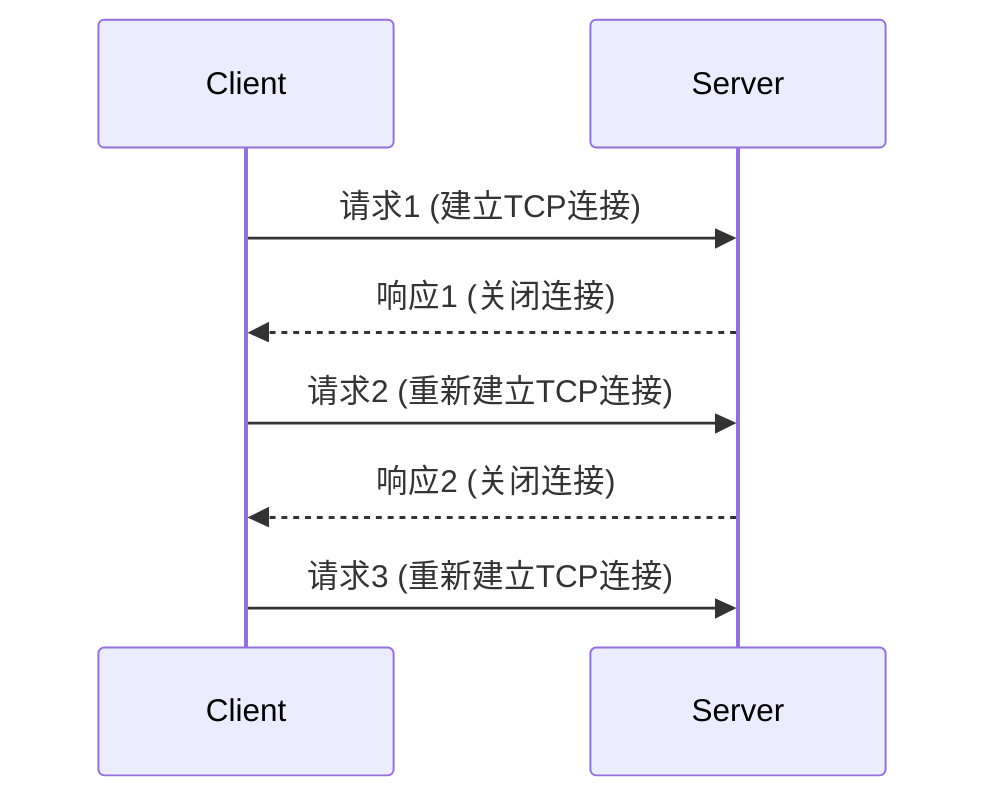
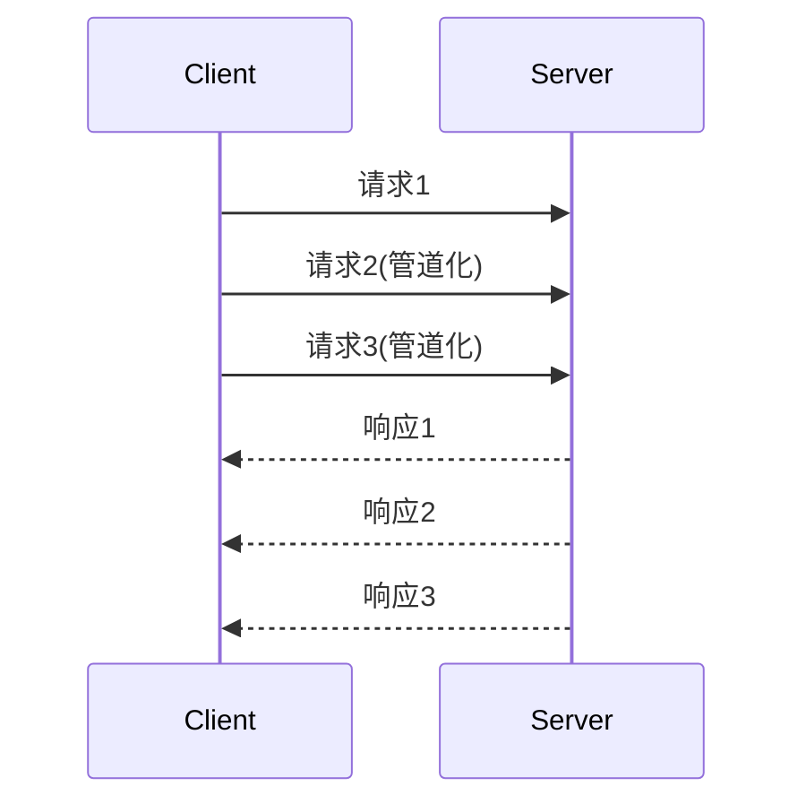
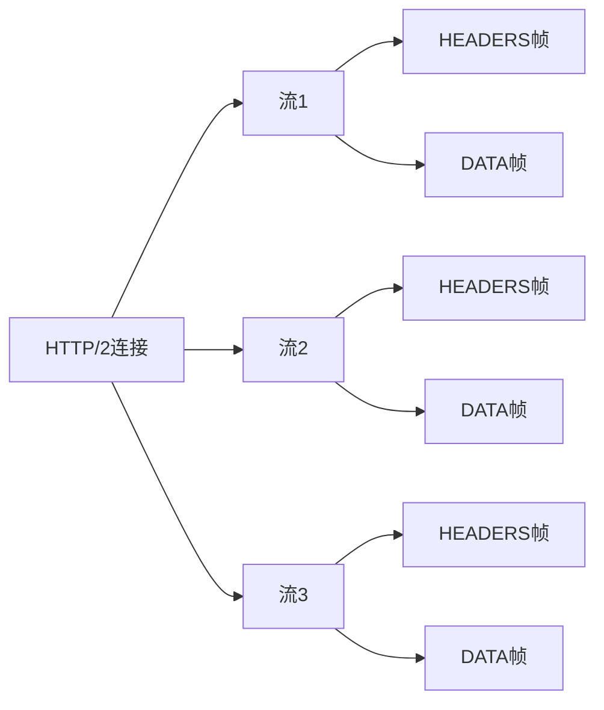
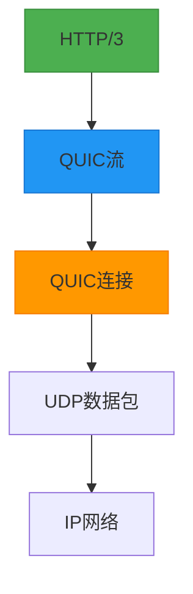
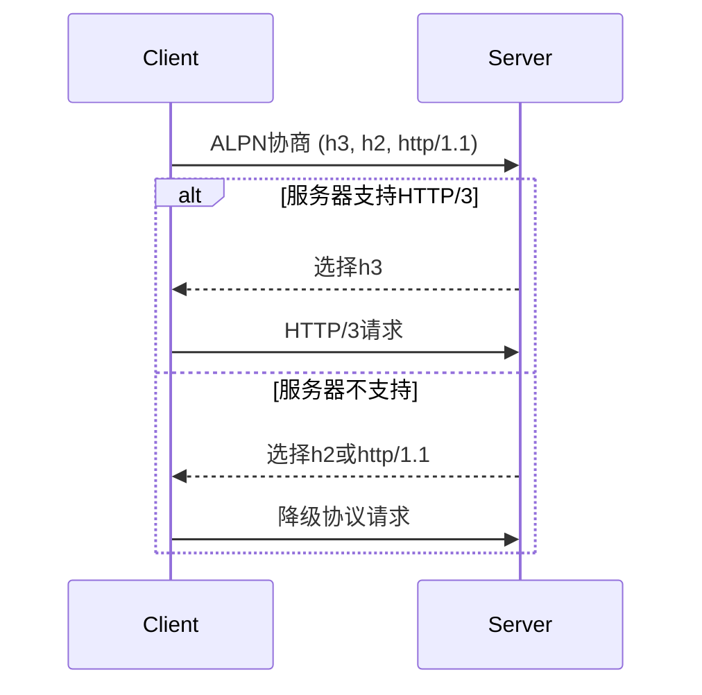
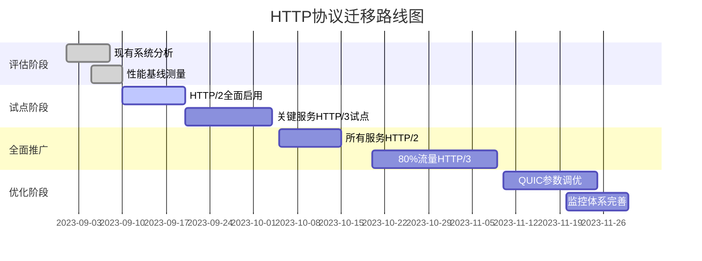

# 🌐 HTTP 协议演进：从 HTTP/1.0 到 HTTP/3 的全面解析

HTTP（HyperText Transfer Protocol）作为互联网的基石协议，经历了多次重大演进。每个版本都针对前一版本的局限性进行了优化，特别是在**性能**、**安全性**和**可靠性**方面。下面是对 HTTP 各版本的深度解析。

---

## 📜 一、HTTP/1.0：基础框架建立（1996 年）

### 🔍 核心特性

- **RFC 文档**：RFC 1945（1996 年）
- **连接管理**：
  - 每个请求/响应使用**独立 TCP 连接**（非持久连接）
  - 完成后立即关闭连接
- **头部限制**：
  - 缺少`Host`头部 → 无法支持**虚拟主机**
  - 基本无缓存控制机制
- **功能局限**：
  - 无内容编码支持（如 gzip 压缩）
  - 无范围请求（无法断点续传）
  - 状态码仅 16 种（200, 404 等基础状态）

### 📡 请求示例

```http
GET /index.html HTTP/1.0
User-Agent: Mozilla/4.0
```

### ⚠️ 主要问题



- **连接开销大**：每个请求需经历 TCP 三次握手 + TLS 握手（约 200-300ms 延迟）
- **资源浪费**：无法复用连接，服务器资源消耗大
- **加载缓慢**：现代网页平均 50+资源，需 50+次连接

---

## 🔄 二、HTTP/1.1：持久连接革命（1999 年）

### 🔍 核心改进（RFC 2616 → RFC 7230-7237）

- **持久连接**（Keep-Alive）：
  - 单个 TCP 连接处理**多个请求**（默认行为）
  - 通过`Connection: keep-alive`显式控制
- **虚拟主机支持**：
  - 新增`Host`头部 → 支持同一 IP 多个域名
```http
  GET /index.html HTTP/1.1
  Host: www.example.com
```
- **高级缓存控制**：
  - `If-Modified-Since`/`Last-Modified`
  - `ETag`/`If-None-Match`
  - `Cache-Control`精细化控制
- **内容优化**：
  - 支持`gzip`压缩（`Accept-Encoding: gzip`）
  - 分块传输编码（`Transfer-Encoding: chunked`）
  - 范围请求（`Range: bytes=0-499` → 断点续传）

### ⚡ 性能提升技术

| 技术         | 说明              | 效果              |
| ------------ | ----------------- | ----------------- |
| **持久连接** | 复用 TCP 连接     | 减少连接开销 70%+ |
| **管道化**   | 多个请求排队发送  | 减少 RTT 等待时间 |
| **内容编码** | gzip 压缩文本资源 | 体积减少 60-80%   |
| **缓存验证** | ETag 验证资源更新 | 避免重复下载      |


### ⚠️ 剩余问题（HTTP/1.1 瓶颈）



- **队头阻塞**（Head-of-Line Blocking）：
  - 响应必须**按序返回**，一个慢请求阻塞后续响应
  - 管道化实际支持度低（浏览器默认禁用）
- **头部冗余**：
  - 每个请求重复发送 Cookie、User-Agent 等头部
  - 小请求中头部占比可达 80%
- **单向通信**：
  - 服务器无法主动推送资源
  - 需要轮询/长连接实现"实时"更新

---

## ⚡ 三、HTTP/2：多路复用突破（2015 年）

### 🔍 核心架构（RFC 7540）

基于 Google 的**SPDY 协议**，**完全兼容 HTTP/1.1 语义**，但**传输层彻底重构**

#### 🌐 二进制分帧层（Binary Framing Layer）



- 将消息分解为**二进制帧**（HEADERS, DATA 等）
- 帧交错传输，接收端重组

#### 🚀 关键特性

| 特性           | 说明                                | 解决的问题             |
| -------------- | ----------------------------------- | ---------------------- |
| **多路复用**   | 单连接并行处理多请求                | 彻底解决队头阻塞       |
| **头部压缩**   | HPACK 算法（静态字典+Huffman 编码） | 减少头部开销 80%+      |
| **服务器推送** | 服务端主动推送关联资源              | 减少 RTT，提升加载速度 |
| **请求优先级** | 客户端指定资源加载顺序              | 优化关键资源加载       |
| **流量控制**   | 基于 WINDOW_UPDATE 帧的流控         | 防止接收方过载         |
| **服务端推送** | `Link: </style.css>; rel=preload`   | 提前加载关键资源       |

### 💻 请求示例（Wireshark 抓包）

```
Frame 1: HEADERS (Stream 1) - :method: GET, :path: /, :authority: example.com
Frame 2: DATA (Stream 1) - ...HTML内容...
Frame 3: HEADERS (Stream 3) - :method: GET, :path: /style.css
Frame 4: DATA (Stream 3) - ...CSS内容...
Frame 5: HEADERS (Stream 5) - :method: GET, :path: /logo.png
```

### 📊 性能实测对比（3G 网络）

| 指标         | HTTP/1.1  | HTTP/2   | 提升 |
| ------------ | --------- | -------- | ---- |
| 首字节时间   | 450ms     | 380ms    | 15%  |
| 页面完全加载 | 2.1s      | 1.5s     | 29%  |
| 请求数限制   | 6-8 并发  | 无限制   | ∞    |
| 头部开销     | 800B/请求 | 20B/请求 | 97%↓ |

### ⚠️ 剩余挑战

- **TCP 层队头阻塞**：
  - 虽然应用层解决，但**TCP 丢包仍影响所有流**
  - 一个数据包丢失 → 整个连接暂停等待重传
- **TLS 握手开销**：
  - TLS 1.2 需 2-RTT 握手 → 增加初始延迟
- **部署复杂度**：
  - 需要 ALPN 支持
  - 服务器配置更复杂

---

## 🚀 四、HTTP/3：基于 QUIC 的终极解决方案（2 惊艳 2 年）

### 🔍 核心变革（RFC 9114）

**彻底放弃 TCP**，基于**QUIC 协议**（Quick UDP Internet Connections）构建

#### ⚡ QUIC 核心创新

| 传统 TCP 问题 | QUIC 解决方案                       |
| ------------- | ----------------------------------- |
| 队头阻塞      | 每个流独立传输，丢包不影响其他流    |
| 连接建立慢    | 0-RTT 快速重连（会话恢复）          |
| 无内置加密    | 内置 TLS 1.3，加密成为标配          |
| 网络切换中断  | 连接 ID 机制，IP 变化不中断连接     |
| 拥塞控制固定  | 可插拔拥塞控制算法（如 CUBIC, BBR） |

#### 🌐 HTTP/3 架构



### 💥 突破性特性

1. **真正解决队头阻塞**

   ```mermaid
   sequenceDiagram
       Client->>Server: 流1(数据包1)
       Client->>Server: 流2(数据包1)
       Client->>Server: 流1(数据包2)
       Client->>Server: 流2(数据包2)
       Note over Server: 数据包2丢失
       Server-->>Client: 确认流1(数据包1)
       Server-->>Client: 确认流2(数据包1,2)
       Note over Client: 流2继续传输，不受流1影响
   ```

2. **0-RTT 连接恢复**

   - 会话恢复无需完整握手
   - 已知服务器可直接发送应用数据
   - **TLS 1.3 0-RTT 模式集成**

3. **连接迁移**

   - 手机从 Wi-Fi 切到 4G → 连接保持
   - 基于 Connection ID 而非 IP:Port

4. **更快的 TLS 集成**
   - QUIC 内置 TLS 1.3
   - 加密握手与 QUIC 握手合并
   - 减少 1-RTT 延迟

### 📊 HTTP/3 性能实测（3G 网络）

| 场景         | HTTP/2 | HTTP/3 | 提升 |
| ------------ | ------ | ------ | ---- |
| 首字节时间   | 380ms  | 290ms  | 24%  |
| 页面加载     | 1.5s   | 1.1s   | 27%  |
| 高丢包率(5%) | 3.2s   | 1.8s   | 44%  |
| 网络切换恢复 | 800ms  | 50ms   | 94%  |

### 🌐 实际部署情况（2023 年）

| 平台           | HTTP/3 支持                   | 备注                       |
| -------------- | ----------------------------- | -------------------------- |
| **Cloudflare** | ✅ 全面支持                   | 全球 95%+请求支持 HTTP/3   |
| **Google**     | ✅ 全面支持                   | YouTube、Search 等核心服务 |
| **Facebook**   | ✅ 部分服务                   | 优先部署在移动端           |
| **Akamai**     | ✅ 全面支持                   | 商用 CDN 默认启用          |
| **主流浏览器** | ✅ Chrome/Firefox/Safari/Edge | 默认启用                   |
| **Node.js**    | ✅ v18.13+                    | `node:http3`模块           |

---

## 🆚 五、四大版本全面对比

### 1. 核心特性对比

| 特性           | HTTP/1.0 | HTTP/1.1          | HTTP/2           | HTTP/3              |
| -------------- | -------- | ----------------- | ---------------- | ------------------- |
| **传输层**     | TCP      | TCP               | TCP              | **UDP (QUIC)**      |
| **连接建立**   | 1-RTT    | 1-RTT             | 1-RTT (TLS 1.2)  | **0-RTT (TLS 1.3)** |
| **多路复用**   | ❌       | ❌ (管道化不实用) | ✅               | ✅                  |
| **头部压缩**   | ❌       | ❌                | ✅ (HPACK)       | ✅ (QPACK)          |
| **服务器推送** | ❌       | ❌                | ✅               | ✅                  |
| **队头阻塞**   | 严重     | 应用层解决        | **TCP 层仍存在** | **彻底解决**        |
| **连接迁移**   | ❌       | ❌                | ❌               | ✅                  |
| **默认加密**   | ❌       | ❌                | 推荐             | **强制**            |
| **标准化**     | RFC 1945 | RFC 7230-7237     | RFC 7540         | RFC 9114            |

### 2. 性能指标对比（典型网页加载）

| 指标             | HTTP/1.1               | HTTP/2        | HTTP/3      |
| ---------------- | ---------------------- | ------------- | ----------- |
| **TCP 连接开销** | 高 (每个域名 6-8 连接) | 低 (单连接)   | 低 (单连接) |
| **TLS 握手延迟** | 1-2 RTT                | 1-2 RTT       | **0-1 RTT** |
| **队头阻塞影响** | 严重                   | 中等 (TCP 层) | **无**      |
| **弱网性能**     | 差                     | 一般          | **优秀**    |
| **请求并发**     | 6-8                    | 无限制        | 无限制      |
| **头部开销**     | 高 (800B+)             | 中 (20-100B)  | 低 (10-50B) |

### 3. 适用场景推荐

| 场景              | 推荐协议   | 原因                   |
| ----------------- | ---------- | ---------------------- |
| **老旧系统/设备** | HTTP/1.1   | 兼容性最好             |
| **现代 Web 应用** | HTTP/2     | 平衡性能与支持度       |
| **移动端应用**    | **HTTP/3** | 弱网优化、网络切换     |
| **实时性要求高**  | HTTP/3     | 0-RTT、无队头阻塞      |
| **全球用户分布**  | HTTP/3     | 连接迁移、高丢包率优化 |
| **IoT 设备通信**  | HTTP/2     | 资源消耗低于 HTTP/3    |

---

## 🛠 六、实战：如何启用 HTTP/3

### 1. 服务器端配置

#### Nginx（需支持 QUIC）

```nginx
# HTTP/3 配置示例
server {
    listen 443 ssl http3;  # 启用HTTP/3
    ssl_certificate      /path/to/cert.pem;
    ssl_certificate_key  /path/to/privkey.pem;

    # QUIC特定配置
    ssl_early_data on;
    ssl_protocols TLSv1.3;

    # HTTP/2 也同时支持
    listen 443 ssl http2;

    # ...
}
```

#### Cloudflare（一键启用）

1. 登录 Cloudflare 控制台
2. 进入"Speed" > "Optimization"
3. 开启"HTTP/3 (QUIC)"选项

### 2. 客户端检测与使用

#### 浏览器检测

```javascript
// 检测是否使用HTTP/3
const isHttp3 =
  window.location.protocol === "https:" &&
  performance.getEntries()[0].nextHopProtocol === "h3";

console.log(`当前协议: ${isHttp3 ? "HTTP/3" : "HTTP/2"}`);
```

#### cURL 测试

```bash
# 测试HTTP/3支持
curl -I --http3 https://example.com

# 对比不同协议性能
time curl -o /dev/null --http1.1 https://example.com
time curl -o /dev/null --http2 https://example.com
time curl -o /dev/null --http3 https://example.com
```

### 3. 降级策略（关键！）



- **ALPN 协商**：客户端在 TLS 握手时声明支持的协议
- **渐进式增强**：始终支持 HTTP/2 和 HTTP/1.1 作为降级方案
- **智能选择**：根据网络质量动态选择协议

---

## 📊 七、性能优化实践指南

### 1. HTTP/1.1 优化技巧

- **域名分片**（Domain Sharding）：
  ```html
  <!-- 将资源分散到不同域名 -->
  <link href="https://static1.example.com/style.css" rel="stylesheet" />
  <link href="https://static2.example.com/script.js" rel="stylesheet" />
  ```
- **资源合并**：
  ```html
  <!-- 合并多个CSS/JS文件 -->
  <link href="bundle.min.css" rel="stylesheet" />
  ```
- **雪碧图**（CSS Sprites）：
  ```css
  .icon-home {
    background: url(sprite.png) 0 0;
  }
  .icon-search {
    background: url(sprite.png) -32px 0;
  }
  ```

### 2. HTTP/2 优化技巧

- **消除域名分片**（反模式！）：
  ```html
  <!-- HTTP/2中应使用单域名 -->
  <link href="https://static.example.com/style.css" rel="stylesheet" />
  <link href="https://static.example.com/script.js" rel="stylesheet" />
  ```
- **服务器推送**：
```http
  Link: </style.css>; rel=preload; as=style
  Link: </logo.png>; rel=preload; as=image
```
- **资源优先级**：
  ```html
  <!-- 关键CSS内联，非关键资源延迟加载 -->
  <link
    rel="preload"
    href="critical.css"
    as="style"
    onload="this.rel='stylesheet'"
  />
  <link
    rel="stylesheet"
    href="non-critical.css"
    media="print"
    onload="this.media='all'"
  />
  ```

### 3. HTTP/3 优化技巧

- **利用 0-RTT**：

  ```javascript
  // 服务端设置
  const sessionTicket = generateSessionTicket();
  res.setHeader("Set-Cookie", `session=${sessionTicket}; max-age=86400`);

  // 客户端复用
  fetch(url, {
    headers: { "Early-Data": "1" },
    body: JSON.stringify({ session: sessionTicket }),
  });
  ```

- **连接迁移测试**：
  ```bash
  # 模拟网络切换
  sudo ifconfig en0 down && sleep 2 && sudo ifconfig en0 up
  ```
- **QUIC 参数调优**：
  ```nginx
  # Nginx QUIC调优
  http3_max_requests 1000;
  http3_hq_concurrent_streams 100;
  ```

---

## 🌐 八、行业采用现状（2023 年）

### 1. 全球支持率

| 协议     | 全球网站支持率 | 移动 App 支持率 | CDN 支持率 |
| -------- | -------------- | --------------- | ---------- |
| HTTP/1.1 | 98%            | 85%             | 100%       |
| HTTP/2   | 85%            | 75%             | 95%        |
| HTTP/3   | **35%**        | **55%**         | **70%**    |

> 📌 数据来源：[W3Techs](https://w3techs.com/technologies/details/ce-http3) & Cloudflare 2023 报告

### 2. 头部公司实践

- **Google**：

  - YouTube 全面使用 HTTP/3
  - 搜索结果页加载速度提升 **15%**
  - 移动端弱网场景性能提升 **40%**

- **Cloudflare**：

  - 全球 95%+请求支持 HTTP/3
  - 高丢包率网络下性能提升 **30%**
  - 连接迁移减少 **90%** 重连时间

- **Facebook**：
  - 移动 App 优先采用 HTTP/3
  - 网络切换时数据丢失减少 **75%**
  - 首屏加载时间减少 **22%**

---

## 🚫 九、迁移挑战与解决方案

### 1. HTTP/3 部署挑战

| 挑战                 | 影响                | 解决方案                              |
| -------------------- | ------------------- | ------------------------------------- |
| **防火墙/NAT 问题**  | UDP 可能被拦截      | 同时支持 HTTP/2，优雅降级             |
| **服务器资源消耗**   | QUIC CPU 开销较高   | 使用专用 QUIC 服务器（如 Cloudflare） |
| **客户端支持不一致** | 旧浏览器不支持      | ALPN 协商自动降级                     |
| **调试工具缺乏**     | 传统工具不支持 QUIC | 使用 Wireshark 3.4+或专用 QUIC 工具   |

### 2. 渐进式迁移策略



### 3. 降级策略最佳实践

```javascript
// 智能协议选择库（简化版）
class HttpProtocolSelector {
  constructor() {
    this.supported = this.detectSupport();
  }

  detectSupport() {
    // 检测浏览器支持
    if (!window.chrome || !window.chrome.loadTimes) {
      return ["h2", "http/1.1"];
    }

    // 检查网络质量
    const isMobile =
      navigator.connection &&
      (navigator.connection.effectiveType === "4g" ||
        navigator.connection.effectiveType === "3g");

    return isMobile ? ["h3", "h2", "http/1.1"] : ["h2", "h3", "http/1.1"];
  }

  selectProtocol() {
    // 优先选择性能最优协议
    if (this.supported.includes("h3") && this.isGoodNetwork()) {
      return "h3";
    }
    if (this.supported.includes("h2")) {
      return "h2";
    }
    return "http/1.1";
  }

  isGoodNetwork() {
    // 实现网络质量检测
    return navigator.connection ? navigator.connection.downlink > 5 : true;
  }
}
```

---

## 🔮 十、未来展望

### 1. HTTP/3 普及趋势

- **2023-2024**：主流网站 70%+支持 HTTP/3
- **2025**：HTTP/3 成为新网站默认协议
- **2026**：HTTP/2 逐步退场，HTTP/1.1 仅用于遗留系统

### 2. QUIC 协议演进

- **QUIC v2**：更高效的拥塞控制
- **IETF 标准化**：更统一的实现
- **企业级优化**：针对企业网络的 QUIC 变种

### 3. 与 Web 技术的融合

- **WebTransport**：基于 QUIC 的双向通信
  ```javascript
  // WebTransport示例
  const transport = new WebTransport("https://example.com:4433/endpoint");
  const stream = await transport.createBidirectionalStream();
  const writer = stream.writable.getWriter();
  writer.write(data);
  ```
- **Web Bundles**：结合 HTTP/3 的资源打包
- **0-RTT 安全增强**：解决重放攻击问题

---

## 💡 总结：HTTP 协议演进的核心逻辑

| 代际         | 核心突破  | 适用场景      | 今日建议            |
| ------------ | --------- | ------------- | ------------------- |
| **HTTP/1.0** | 基础框架  | 历史系统      | ❌ 避免新项目使用   |
| **HTTP/1.1** | 持久连接  | 旧设备兼容    | ⚠️ 作为降级方案     |
| **HTTP/2**   | 多路复用  | 现代 Web 应用 | ✅ **当前推荐主力** |
| **HTTP/3**   | QUIC 革命 | 移动/弱网场景 | ✅ **新项目首选**   |

> ✅ **终极建议**：  
> **"部署 HTTP/2 作为基础，逐步启用 HTTP/3，保留 HTTP/1.1 作为降级方案"**  
> 这是 2023 年最合理的 HTTP 协议策略，能兼顾**性能**、**兼容性**和**未来准备度**。

立即行动：

1. 使用 [HTTP/3 Test](https://http3check.net/) 检测你的网站
2. 在 CDN 配置中启用 HTTP/3（Cloudflare/Akamai 等一键开启）
3. 通过浏览器 DevTools 的"Network"标签检查协议使用情况
4. 为关键 API 实现协议自适应逻辑

**网络协议的演进从未停止，但每一次进步都让用户体验更上一层楼！** 🚀
