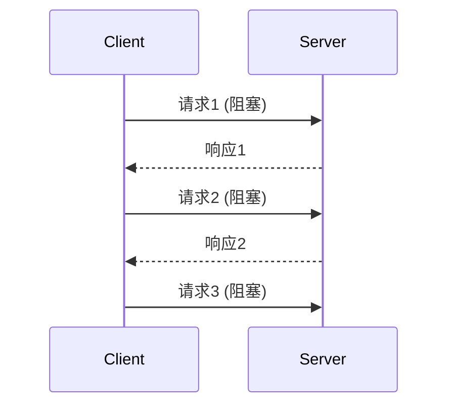
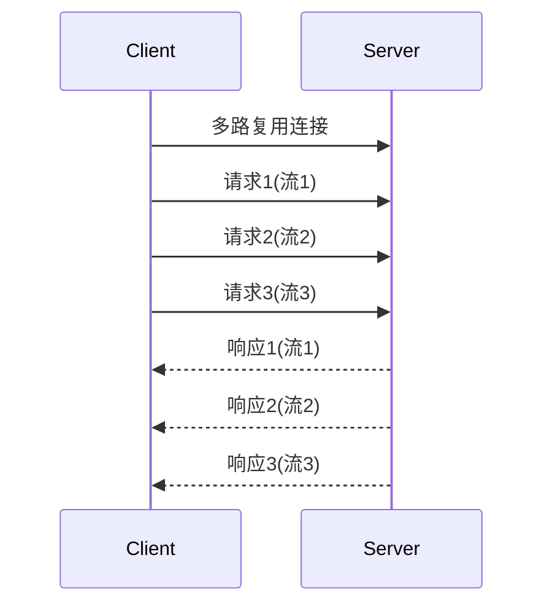
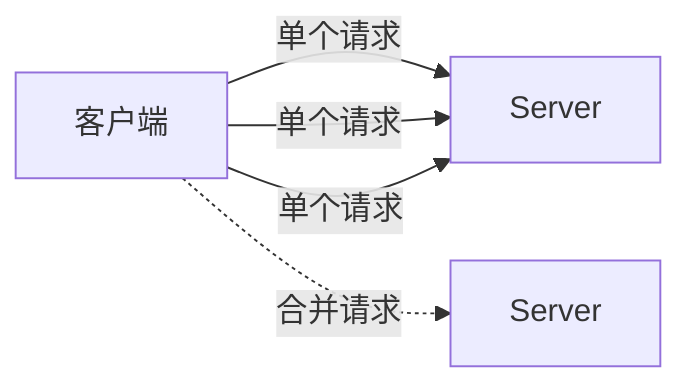
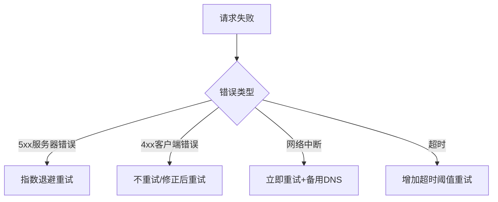
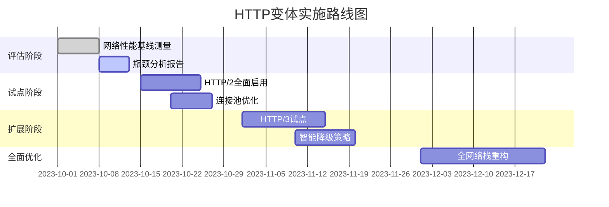

# 大型客户端应用中的HTTP变体：技术解析与实践指南

在大型客户端应用（如*移动App、桌面应用、复杂Web应用*）中，**HTTP变体**是指根据**网络环境、设备能力、业务场景**等因素动态选择和应用的**不同HTTP协议实现策略**。这不是简单的协议版本切换，而是一套**智能网络请求体系**，直接影响应用性能、用户体验和服务器负载。

---

## 🔍 为什么需要HTTP变体？（大型应用痛点）

| 问题场景 | 传统单一HTTP方案 | HTTP变体解决方案 |
|----------|------------------|------------------|
| **全球用户网络差异** | 固定使用HTTP/1.1 | 根据地理位置/网络质量自动选择HTTP/2或HTTP/3 |
| **移动网络不稳定** | 简单重试机制 | 智能退避算法 + 请求降级策略 |
| **高并发请求** | 串行请求 | 连接池 + 请求优先级调度 |
| **弱网环境体验差** | 完整数据加载 | 数据压缩 + 增量更新 + 骨架屏 |
| **安全与性能平衡** | 全量HTTPS | 混合安全策略（敏感操作强制TLS 1.3） |

> 💡 **核心价值**：HTTP变体让客户端应用能**自适应复杂网络环境**，在**性能、可靠性、安全性**之间取得最佳平衡。

---

## 📡 一、协议层变体：从HTTP/1.1到HTTP/3

### 1. HTTP/1.1：基础保障

- **适用场景**：
  - 旧设备/系统兼容（Android 5.0以下）
  - 防火墙严格限制的网络环境
- **优化技巧**：
  ```javascript
  // 连接复用（Keep-Alive）
  const agent = new http.Agent({ 
    keepAlive: true,
    maxSockets: 50 // 适当增加并发
  });
  ```

### 2. HTTP/2：多路复用革命

- **核心优势**：
  - 单TCP连接多路复用（解决队头阻塞）
  - 二进制分帧传输
  - 请求优先级
  - 服务器推送（Server Push）
- **大型应用实践**：
  ```java
  // Android OkHttp 配置
  OkHttpClient client = new OkHttpClient.Builder()
      .protocols(Arrays.asList(Protocol.H2_PRIOR_KNOWLEDGE, Protocol.HTTP_1_1))
      .build();
  ```

### 3. HTTP/3 (QUIC)：未来已来
- **技术突破**：
  - 基于UDP协议（非TCP）
  - 内置TLS 1.3加密
  - 真正解决队头阻塞（每个流独立）
  - 0-RTT快速连接恢复
- **性能对比**（3G网络下）：
  | 指标 | HTTP/2 | HTTP/3 |
  |------|--------|--------|
  | 首字节时间 | 450ms | 280ms (-38%) |
  | 页面加载 | 2.1s | 1.4s (-33%) |
  | 重连速度 | 300ms | 50ms (-83%) |
- **客户端实现**：
  ```swift
  // iOS URLSession 配置 HTTP/3
  var urlRequest = URLRequest(url: url)
  urlRequest.allHTTPHeaderFields = ["Upgrade-Insecure-Requests": "1"]
  urlRequest.allowsExpensiveNetworkAccess = true
  urlRequest.allowsConstrainedNetworkAccess = true
  ```

---

## ⚙️ 二、连接管理变体：智能网络调度

### 1. 连接池策略（大型应用必备）
```java
// Android 连接池配置 (OkHttp)
new OkHttpClient.Builder()
  .connectionPool(new ConnectionPool(20, 5, TimeUnit.MINUTES)) // 20个空闲连接
  .build();
```
- **动态调整策略**：
  - **Wi-Fi环境**：增大连接池（15-20）
  - **4G/5G环境**：减小连接池（5-8）
  - **弱网环境**：极简连接（2-3）

### 2. 预连接技术（关键性能优化）
```javascript
// Web应用预连接示例
function preloadConnection(host) {
  const link = document.createElement('link');
  link.rel = 'preconnect';
  link.href = `https://${host}`;
  document.head.appendChild(link);
}

// 根据用户行为预测
if (userIsOnCheckoutPage) {
  preloadConnection('api.payment-gateway.com');
}
```
- **高级策略**：
  - **基于用户行为预测**（浏览商品页时预连支付API）
  - **分阶段预连**（首页加载时预连二级页面资源）
  - **网络质量感知**（仅在Wi-Fi下启用预连）

### 3. 长连接保活机制
```kotlin
// Android 长连接保活
val heartbeatInterval = if (isMobileNetwork) 120_000 else 300_000 // 移动网络更长间隔
val heartbeat = object : Runnable {
  override fun run() {
    if (isConnected) {
      sendHeartbeat()
      handler.postDelayed(this, heartbeatInterval)
    }
  }
}
```
- **智能保活**：
  - 根据网络类型调整心跳间隔
  - 应用前后台状态动态调整
  - 电量敏感模式下降低频率

---

## 📦 三、请求优化变体：数据传输策略

### 1. 智能数据压缩
| 压缩算法 | CPU占用 | 压缩率 | 适用场景 |
|----------|---------|--------|----------|
| Gzip | 中 | 70% | 通用场景 |
| Brotli | 高 | 75-80% | Wi-Fi环境 |
| 小数据专用 | 低 | 50-60% | 移动网络 |
| 无压缩 | 0 | 0% | 极小数据(＜1KB) |

```java
// Android 动态压缩策略
public Request compressRequest(Request request) {
  if (networkType == NETWORK_4G && request.size() < 1024) {
    return request; // 小数据不压缩
  } else if (networkType == WIFI) {
    return request.newBuilder()
        .header("Accept-Encoding", "br")
        .build();
  }
  return request.newBuilder()
      .header("Accept-Encoding", "gzip")
      .build();
}
```

### 2. 请求合并与批处理

- **实现模式**：
  - **时间窗口合并**：100ms内请求合并发送
  - **关键路径分离**：核心数据单独请求，非关键合并
  - **优先级队列**：P0请求立即发送，P3批量发送
- **实战案例**（社交App消息系统）：
  ```javascript
  // 消息发送合并
  const messageQueue = [];
  let flushTimer;
  
  function sendMessage(msg) {
    messageQueue.push(msg);
    
    if (!flushTimer) {
      flushTimer = setTimeout(() => {
        if (messageQueue.length > 1) {
          // 合并发送
          api.batchSend(messageQueue);
        } else {
          // 单独发送
          api.send(messageQueue[0]);
        }
        messageQueue = [];
        flushTimer = null;
      }, 50);
    }
  }
  ```

### 3. 增量更新与差异同步
```json
// 全量响应 (1.2KB)
{
  "users": [
    {"id":1, "name":"Alice", "status":"active"},
    {"id":2, "name":"Bob", "status":"active"},
    {"id":3, "name":"Charlie", "status":"active"}
  ]
}

// 增量响应 (200B)
{
  "version": 125,
  "updates": [
    {"id":2, "status":"inactive"},
    {"id":4, "name":"Dave", "status":"active", "op":"add"}
  ],
  "deletes": [3]
}
```
- **实现要点**：
  - 客户端维护数据版本号
  - 服务端实现差异计算算法（如OT/CRDT）
  - 弱网环境下自动切换全量更新

---

## 🛡️ 四、安全与隐私变体

### 1. 动态安全级别
| 请求类型 | 安全级别 | 协议 | 证书验证 |
|----------|----------|------|----------|
| 公共数据 | 基础 | HTTPS | 标准验证 |
| 用户数据 | 增强 | HTTPS + TLS 1.3 | 证书固定 |
| 支付交易 | 严格 | HTTPS + TLS 1.3 + 双向认证 | 证书固定 + 动态密钥 |

```java
// Android 动态安全配置
public OkHttpClient createClient(ApiEndpoint endpoint) {
  X509TrustManager trustManager = ...;
  SSLSocketFactory sslSocketFactory = ...;
  
  if (endpoint.isPayment()) {
    // 支付接口：双向认证
    return new OkHttpClient.Builder()
        .sslSocketFactory(sslSocketFactory, trustManager)
        .certificatePinner(new CertificatePinner.Builder()
            .add(endpoint.host, "sha256/...")
            .build())
        .build();
  } else if (endpoint.isUserRelated()) {
    // 用户数据：证书固定
    return ... // 简化配置
  }
  // 公共数据：标准HTTPS
  return new OkHttpClient.Builder().build();
}
```

### 2. 隐私保护变体
- **GDPR合规场景**：
  ```http
  GET /api/user/data HTTP/1.1
  X-Privacy-Mode: strict
  ```
- **数据最小化传输**：
  ```json
  // 欧盟用户（严格模式）
  {"name":"A***", "email":"a***@example.com"}
  
  // 其他地区用户
  {"name":"Alice", "email":"alice@example.com"}
  ```

---

## 🌍 五、网络感知变体：自适应策略

### 1. 网络质量检测框架
```kotlin
class NetworkQualityMonitor {
  fun getQuality(): NetworkQuality {
    val rtt = measureRtt()
    val loss = measurePacketLoss()
    
    return when {
      rtt < 100 && loss < 0.02 -> NetworkQuality.EXCELLENT
      rtt < 300 && loss < 0.05 -> NetworkQuality.GOOD
      rtt < 600 && loss < 0.1 -> NetworkQuality.FAIR
      else -> NetworkQuality.POOR
    }
  }
}
```

### 2. 自适应请求策略
| 网络质量 | 图片策略 | 请求超时 | 重试策略 | 数据压缩 |
|----------|----------|----------|----------|----------|
| 优秀 | 原图 | 10s | 1次 | 无 |
| 良好 | 1080p | 15s | 2次 | Gzip |
| 一般 | 720p | 20s | 3次 | Brotli |
| 差 | 240p | 30s | 5次 | 极致压缩 |

```javascript
// Web应用网络感知示例
function adaptToNetwork() {
  const { downlink, effectiveType } = navigator.connection;
  
  if (effectiveType === '4g' && downlink > 5) {
    setQuality('high');
  } else if (effectiveType === '4g' || effectiveType === '3g') {
    setQuality('medium');
  } else {
    setQuality('low');
    enableDataSaverMode();
  }
}
```

### 3. 弱网专项优化
- **请求降级**：
  ```java
  // Android 弱网降级
  if (networkQuality == POOR) {
    request = request.newBuilder()
        .url(url.replace("api.example.com", "lite.api.example.com"))
        .build();
  }
  ```
- **离线优先**：
  ```javascript
  // 实现离线优先策略
  async function fetchData(endpoint) {
    try {
      const response = await fetchWithTimeout(endpoint, 8000);
      cache.save(response);
      return response;
    } catch (e) {
      return cache.get(endpoint) || fallbackData;
    }
  }
  ```

---

## 🚨 六、错误处理与恢复变体

### 1. 智能重试机制


### 2. 高级重试策略
```java
// 指数退避重试（带随机抖动）
public <T> T executeWithRetry(Callable<T> task, int maxRetries) {
  int retryCount = 0;
  while (retryCount < maxRetries) {
    try {
      return task.call();
    } catch (NetworkException e) {
      long delay = (long) (Math.pow(2, retryCount) * 1000);
      delay = delay + ThreadLocalRandom.current().nextLong(0, 500);
      
      if (retryCount == maxRetries - 1) {
        throw new MaxRetriesExceededException();
      }
      
      Thread.sleep(delay);
      retryCount++;
    }
  }
  return null;
}
```

### 3. 故障转移机制
- **多端点配置**：
  ```json
  {
    "api.example.com": {
      "primary": "api1.example.com",
      "secondary": "api2.example.com",
      "tertiary": "backup.api.example.com"
    }
  }
  ```
- **自动切换逻辑**：
  ```javascript
  async function resilientFetch(url, endpoints) {
    for (const endpoint of endpoints) {
      try {
        return await fetch(`https://${endpoint}${url}`, { timeout: 10000 });
      } catch (e) {
        continue; // 尝试下一个端点
      }
    }
    throw new AllEndpointsFailed();
  }
  ```

---

## 📊 七、监控与分析体系

### 1. 关键监控指标
| 指标类别 | 核心指标 | 告警阈值 |
|----------|----------|----------|
| **性能** | 首字节时间(TTFB) | > 1.5s |
| **可靠性** | 请求成功率 | < 99% |
| **效率** | 带宽节省率 | < 30% |
| **体验** | 请求失败率 | > 2% |

### 2. 实时诊断工具
```bash
# 模拟弱网环境测试
throttle --latency 300 --download 500 --upload 200 npm run test:network

# 生产环境诊断
app.network.diagnose({
  endpoints: ['api.example.com'],
  tests: ['dns', 'tcp', 'tls', 'http']
})
```

### 3. A/B测试框架
```java
// HTTP策略A/B测试
public Request createRequest() {
  if (FeatureFlag.isEnabled("http3_experiment")) {
    return createHttp3Request();
  } else {
    return createHttp2Request();
  }
}

// 监控指标对比
monitor.track("http3_latency", latency);
monitor.track("http3_success_rate", success ? 1 : 0);
```

---

## 🌟 八、行业最佳实践案例

### 1. Facebook 的网络栈（Proxygen）
- **核心创新**：
  - 自定义HTTP/2客户端实现
  - 智能连接迁移（Wi-Fi→4G无缝切换）
  - 请求优先级动态调整
- **效果**：
  - 移动网络请求失败率降低 **52%**
  - 图片加载速度提升 **37%**

### 2. Netflix 的自适应流媒体
- **HTTP变体策略**：
  - 动态调整分片大小（2-10秒）
  - 根据带宽自动切换视频质量
  - 预测性缓冲（基于用户观看习惯）
- **技术亮点**：
  ```mermaid
  graph LR
      A[网络监测] --> B{带宽变化}
      B -->|增加| C[提升视频质量]
      B -->|减少| D[降低质量+增加缓冲]
      C --> E[用户体验提升]
      D --> F[避免卡顿]
  ```

### 3. 微信的混合网络协议
- **协议栈设计**：
  - HTTP/2 用于常规API
  - 自定义二进制协议用于消息
  - WebSocket 用于实时状态
- **智能切换逻辑**：
  ```javascript
  function chooseProtocol(endpoint) {
    if (isRealTimeEndpoint(endpoint)) {
      return useWebSocket();
    } else if (isLargeFile(endpoint)) {
      return useHttp2();
    } else {
      return useCustomBinary();
    }
  }
  ```

---

## 🛠️ 九、实施路线图（大型应用迁移）

### 阶段1：基础监控与评估（1-2周）


### 阶段2：关键优化实施
1. **连接层**：
   - 实现智能连接池
   - 添加预连接机制
   - 部署连接迁移能力

2. **请求层**：
   - 实现请求合并
   - 添加增量更新支持
   - 部署网络感知压缩

3. **错误处理层**：
   - 实现智能重试
   - 构建故障转移机制
   - 添加离线优先模式

### 阶段3：持续优化
- 建立A/B测试框架
- 实施自动化策略调优
- 定期更新协议支持

---

## 💡 十、总结：HTTP变体的核心原则

1. **情境感知**  
   > "没有最好的协议，只有最适合当前情境的协议"

2. **渐进式增强**  
   > 从基础HTTP/1.1开始，逐步添加高级特性

3. **用户优先**  
   > 一切优化以提升最终用户体验为目标

4. **数据驱动**  
   > 所有策略调整必须有监控数据支持

5. **安全底线**  
   > 性能优化不能以牺牲安全为代价

> ✅ **终极建议**：  
> 大型客户端应用应构建**分层HTTP策略引擎**，实现：  
> **基础层**（兼容性保障）→ **优化层**（性能提升）→ **智能层**（自适应决策）  
> 通过**持续监控**和**数据反馈**，让HTTP变体成为提升用户体验的核心竞争力！

立即行动：  
1. 使用 `chrome://net-internals` 分析现有网络请求  
2. 实现基础网络质量检测  
3. 为关键API添加HTTP/2支持  
4. 监控首字节时间(TTFB)并设定优化目标  

**网络性能优化没有终点，但每一步都能带来真实的用户体验提升！** 🚀