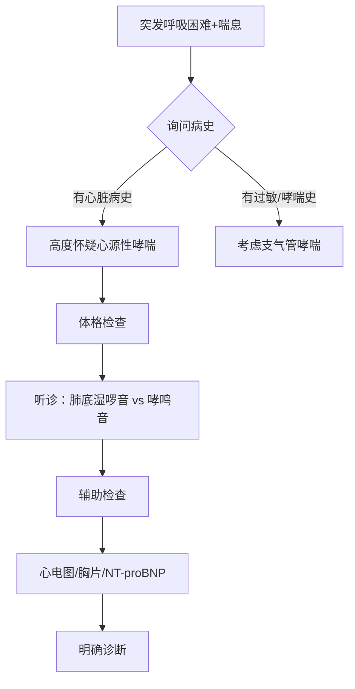

# 心源性哮喘：症状、诊断与治疗的全面解析

## 基本定义

**心源性哮喘**（Cardiac Asthma）是指由于**左心衰竭**导致急性肺水肿而引起的**阵发性夜间呼吸困难**，临床表现为喘息、气促、咳嗽等症状，与支气管哮喘极为相似，但**病因和治疗原则完全不同**。

> 💡 **关键区别**：心源性哮喘是**心脏疾病**（心力衰竭）的表现，而非呼吸道疾病。错误地将其当作支气管哮喘治疗可能危及生命！

---

## 病因与发病机制

### 核心病理过程

### 主要病因
| 病因类别 | 具体疾病 |
|----------|----------|
| **冠状动脉疾病** | 心肌梗死、严重心绞痛 |
| **心肌疾病** | 扩张型心肌病、肥厚型心肌病 |
| **心脏瓣膜病** | 二尖瓣狭窄/关闭不全、主动脉瓣狭窄 |
| **高血压** | 长期未控制的高血压导致左心室肥厚 |
| **心律失常** | 快速性心律失常（如房颤） |
| **其他** | 急性心肌炎、心脏淀粉样变 |

### 发病机制关键点
1. **肺静脉高压**：左心衰竭 → 肺静脉回流受阻 → 肺毛细血管压力 > 25mmHg（正常<15mmHg）
2. **液体渗出**：当压力 > 30mmHg → 液体从血管渗入肺间质 → 肺泡
3. **气道受压**：肺间质水肿压迫小气道 → 气道狭窄 → 喘鸣音
4. **神经反射**：肺毛细血管压力升高刺激J受体 → 反射性呼吸加快

---

## 临床表现

### 典型症状（与支气管哮喘的关键区别）
| 特征 | 心源性哮喘 | 支气管哮喘 |
|------|------------|------------|
| **发作时间** | 多在**夜间熟睡后1-2小时** | 可在任何时间，常与过敏原接触相关 |
| **诱发因素** | 体位改变（平卧加重）、体力活动、高盐饮食 | 过敏原、冷空气、运动、感染 |
| **呼吸困难特点** | 突发**端坐呼吸**，需坐起或站立缓解 | 呼气性呼吸困难为主 |
| **咳嗽特点** | 咳**粉红色泡沫痰**（典型表现） | 咳白色黏痰，少见血性痰 |
| **缓解方式** | 坐起、吸氧、利尿剂 | 支气管扩张剂（如沙丁胺醇） |
| **病史** | 有心脏病史（冠心病、高血压等） | 有哮喘或过敏史 |
| **体位影响** | **平卧加重**，坐位/站立减轻 | 与体位关系不大 |

### 伴随症状
- **心血管症状**：
  - 心悸、胸闷
  - 下肢水肿（慢性心衰表现）
  - 颈静脉怒张
- **呼吸系统症状**：
  - 喘息样呼吸（但本质是肺水肿）
  - 两肺底湿啰音（典型表现，区别于哮喘的哮鸣音）
  - 严重时咳粉红色泡沫痰
- **全身症状**：
  - 焦虑、恐惧感
  - 冷汗
  - 皮肤湿冷

---

## 诊断方法

### 临床评估流程

### 关键诊断检查
| 检查项目          | 心源性哮喘表现                                          | 诊断价值    |
| ------------- | ------------------------------------------------ | ------- |
| **体格检查**      | ① 心界扩大 ② 心尖区舒张期奔马律 ③ 两肺底湿啰音（对称） ④ 颈静脉怒张 | 首要鉴别点   |
| **胸部X光**      | ① 肺门蝶形阴影 ② Kerley B线 ③ 心脏增大                | 确诊肺水肿   |
| **心电图**       | ① 心肌缺血/梗死改变 ② 左室高电压 ③ 心律失常                 | 寻找心脏病因  |
| **NT-proBNP** | 显著升高（>400 pg/mL）                                 | 最具特异性指标 |
| **超声心动图**     | ① LVEF降低 ② 左房/左室扩大 ③ 瓣膜病变                  | 评估心脏功能  |
| **动脉血气**      | 低氧血症，早期可有呼吸性碱中毒                                  | 评估严重程度  |

### NT-proBNP诊断阈值（关键指标）
| 临床情况 | NT-proBNP阈值 | 说明 |
|----------|---------------|------|
| **排除急性心衰** | < 300 pg/mL | 基本可排除 |
| **诊断急性心衰** | > 450 pg/mL（<50岁） > 900 pg/mL（50-75岁） > 1800 pg/mL（>75岁） | 年龄校正阈值 |
| **灰区值** | 300-450 pg/mL | 需结合其他检查 |

> 💡 **重要提示**：NT-proBNP是鉴别心源性哮喘与支气管哮喘的**最可靠血液指标**！

---

## 与支气管哮喘的鉴别诊断（生死攸关！）

| 特征            | 心源性哮喘                        | 支气管哮喘                     |
| ------------- | ---------------------------- | ------------------------- |
| **本质**        | **左心衰竭**表现                   | **气道慢性炎症**                |
| **年龄**        | 多>40岁，老年人多见                  | 多<40岁，儿童/青壮年多见            |
| **心脏病史**      | 有（高血压、冠心病等）                  | 无，可能有过敏史                  |
| **发作特点**      | *夜间*阵发，**端坐呼吸**              | 可*随时*发作，与过敏原相关            |
| **咳嗽痰液**      | **粉红色泡沫痰**                   | 白色黏痰，少血性                  |
| **肺部听诊**      | **两肺底对称湿啰音**                 | **全肺哮鸣音**                 |
| **心脏听诊**      | 奔马律，心脏杂音                     | 正常                        |
| **X光表现**      | 肺门蝶形阴影，心影大                   | 肺透亮度增加，无心影增大              |
| **NT-proBNP** | **显著升高**                     | 正常或轻度升高                   |
| **治疗反应**      | **利尿剂+强心药有效** 支气管扩张剂无效或加重 | **支气管扩张剂迅速缓解** 强心利尿剂无效 |

### 致命错误：将心源性哮喘误诊为支气管哮喘
- **错误治疗**：给予β2受体激动剂（如沙丁胺醇）
- **严重后果**：
  - 心率加快 → 加重心衰
  - 心肌耗氧增加 → 诱发心肌缺血
  - 可能导致病情急剧恶化，甚至死亡

---

## 治疗方案

### 🚨 急性发作期处理（急救措施）

#### 1. **一般处理**
- **体位**：端坐位，双腿下垂（减少回心血量）
- **吸氧**：6-8L/min，可加用20-30%乙醇湿化（降低泡沫表面张力）
- **心电监护**：持续监测心率、血压、血氧

#### 2. **药物治疗**
| 药物类别      | 代表药物 | 作用机制                                   | 用法                                  |
| --------- | ---- | -------------------------------------- | ----------------------------------- |
| **镇静剂**   | 吗啡   | ① 镇静减轻焦虑 ② 扩张静脉减少回心血量 ③ 减弱呼吸中枢反应 | 3-5mg IV，必要时5-15分钟后重复               |
| **利尿剂**   | 呋塞米  | 快速利尿，减少血容量，降低心脏前负荷                     | 20-40mg IV，2分钟内起效                   |
| **血管扩张剂** | 硝酸甘油 | 扩张小静脉→减少回心血量 扩张冠脉→改善心肌供血            | 0.3-0.6mg 舌下含服 或 5-10μg/min IV泵入 |
|           | 硝普钠  | 强效动静脉扩张剂                               | 0.3-0.5μg/kg/min IV泵入               |
| **强心药**   | 毛花苷C | 增强心肌收缩力，减慢心率                           | 0.2-0.4mg IV（适用于快速房颤伴心衰）            |
| **氨茶碱**   | 氨茶碱  | 轻度强心、利尿、扩支气管                           | 0.125-0.25g IV（谨慎使用）                |

> ⚠️ **禁忌**：***避免使用β2受体激动剂（如沙丁胺醇），可能加重心衰！***

### 稳定期治疗（病因治疗）
1. **基础心脏病治疗**：
   - 冠心病：血运重建、抗缺血治疗
   - [[瓣膜病]]：评估手术指征
   - 高血压：强化降压治疗

2. **心衰标准治疗**：
   - **ARNI/ACEI/ARB**：改善预后
   - **β受体阻滞剂**：美托洛尔、比索洛尔
   - **MRA**：螺内酯
   - **SGLT2抑制剂**：达格列净（新突破）

3. **生活方式管理**：
   - 限盐（<5g/天）
   - 限水（根据心衰程度）
   - 体重监测
   - 适度运动（心衰康复）

---

## 预防与预后

### 预后因素
| 预后良好因素                                                | 预后不良因素                                                         |
| ----------------------------------------------------- | -------------------------------------------------------------- |
| • 及时诊断治疗 • 病因可纠正（如急性心梗后） • 年轻患者 • LVEF > 40% | • 高龄 • 反复发作 • LVEF < 30% • 合并肾功能不全 • NT-proBNP持续升高 |

### 预防措施
1. **控制基础疾病**：
   - 高血压患者严格控制血压（<130/80mmHg）
   - 冠心病患者规范二级预防
   - 瓣膜病患者定期随访

2. **心衰管理**：
   - 遵医嘱服药，不自行停药
   - 每日监测体重（突然增加2kg需警惕）
   - 限制液体摄入（根据医生建议）

3. **生活方式调整**：
   - 低盐饮食（避免腌制食品、加工食品）
   - 戒烟限酒
   - 适度有氧运动（如步行）
   - 避免过度劳累和情绪激动

4. **预警信号教育**：
   - 夜间阵发性呼吸困难
   - 劳力性呼吸困难加重
   - 下肢水肿进行性加重
   - 体重短期内明显增加

---

## 🆘 紧急情况处理指南

### 当您或家人出现以下症状，请**立即拨打急救电话**：
- 突发严重呼吸困难，无法平卧
- 咳出粉红色泡沫痰
- 极度焦虑、濒死感
- 口唇发绀、大汗淋漓
- 意识模糊或丧失

### 在等待急救期间：
1. **保持冷静**，让患者采取**端坐位，双腿下垂**
2. **松开紧身衣物**，保持呼吸道通畅
3. **有条件时给予高流量吸氧**
4. **如有医生处方**，可舌下含服硝酸甘油（0.5mg，5分钟可重复1次，最多3次）
5. **切勿自行服用支气管哮喘药物**（如沙丁胺醇气雾剂）

---

## 流行病学数据

- **发病率**：在心力衰竭患者中，约30-40%会出现心源性哮喘症状
- **误诊率**：高达25-30%（常被误诊为支气管哮喘）
- **死亡率**：急性发作期未经治疗死亡率可达40%
- **5年生存率**：
  - 及时规范治疗：60-70%
  - 误诊或延误治疗：<30%

---

## 重要提醒

1. **切勿自我诊断**：呼吸困难原因复杂，必须由专业医生鉴别
2. **既往有心脏病者**：出现呼吸困难应首先考虑心源性原因
3. **老年人新发"哮喘"**：高度警惕心源性哮喘可能
4. **治疗差异巨大**：心源性哮喘需要**强心、利尿、扩血管**，而非支气管扩张剂
5. **预防胜于治疗**：规范管理基础心脏病是预防关键

> ❤️ **最后强调**：心源性哮喘是**心力衰竭的紧急表现**，不是真正的哮喘。准确识别、及时正确治疗可挽救生命，误诊误治可能导致严重后果甚至死亡。如有疑虑，请立即就医！

如果您或家人有心脏病史并出现类似哮喘症状，请务必告知医生这一重要病史，避免误诊误治。