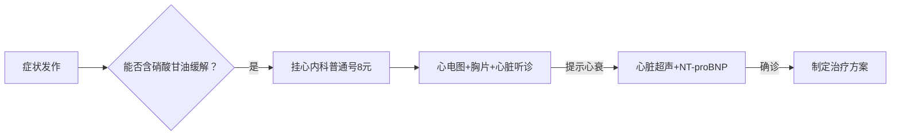

# 心源性哮喘检查全攻略：从怀疑到确诊的完整路径（含鞍山本地实操指南）

心源性哮喘是**左心衰竭的急性表现**，常被误诊为支气管哮喘，但**检查方向完全相反**！错误诊断可能导致致命后果。您描述的"**喘不上气，硝酸甘油有效**"正是心源性哮喘的**核心线索**。以下为您梳理**从怀疑到确诊的完整检查流程**，特别包含鞍山地区实操建议：

---

## 🔍 一、第一步：自我初步判断（在家即可完成）

### ✅ 7个关键自测问题（符合3条以上高度怀疑心源性哮喘）
| 问题 | 是 | 否 | 临床意义 |
|------|----|----|----------|
| 1. 呼吸困难是否**夜间/凌晨发作**（熟睡后憋醒）？ | □ | □ | 心源性哮喘80%在夜间发作 |
| 2. **坐起后5-10分钟是否明显缓解**？ | □ | □ | 体位改变是心衰典型特征 |
| 3. **含服硝酸甘油是否3-5分钟缓解**？ | □ | □ | **最核心线索！** |
| 4. 是否有**高血压/冠心病/糖尿病**病史？ | □ | □ | 心衰主要基础疾病 |
| 5. **下肢是否经常水肿**（按压凹陷）？ | □ | □ | 体循环淤血表现 |
| 6. **3天内体重是否增加>2kg**？ | □ | □ | 液体潴留标志 |
| 7. 是否有**粉红色泡沫痰**？ | □ | □ | 肺水肿典型表现 |

> 📌 **自测结果解读**：  
> - **≥4项"是"** → **高度怀疑心源性哮喘**，24小时内必须就医  
> - **硝酸甘油有效（第3项）+ 夜间发作（第1项）** → **90%以上为心源性**  

---

## 🩺 二、就医检查全流程（从门诊到确诊）

### 📋 阶段1：门诊初筛（30分钟完成，鞍山费用<200元）

| 检查项目 | 为什么做？ | 正常结果 | 心源性哮喘典型表现 | 鞍山实操建议 |
|----------|------------|----------|---------------------|--------------|
| **1. 问诊+查体** | 识别关键线索 | 无特殊体征 | • **端坐呼吸**<br>• **双肺底湿啰音**（区别于哮喘的哮鸣音）<br>• **心尖区奔马律** | **重点告诉医生**：<br>"喘不上气，含硝酸甘油5分钟缓解" |
| **2. 12导联心电图** | 排查心肌缺血/心梗 | 正常 | • ST-T改变<br>• 左室高电压<br>• 房颤等心律失常 | 鞍山三甲医院均<35元，医保报销后<12元<br>**必须在症状发作时做！** |
| **3. 胸部X光** | 查肺水肿 | 肺野清晰 | • **肺门蝶翼征**<br>• Kerley B线<br>• 心脏增大 | 鞍山价格60-80元，报销后<25元<br>**平卧位+站立位都要拍** |

> ✅ **鞍山门诊技巧**：  
> - 挂号时直接说"**查心衰三项**"（心电图+胸片+心脏听诊），避免被引导做肺功能  
> - 带上您用的**硝酸甘油药瓶**，医生会重视这个关键线索  

### 📋 阶段2：核心确诊检查（当天可完成，鞍山费用约250元）

| 检查项目 | 为什么是金标准？ | 临界值 | 您的结果解读 | 鞍山实操贴士 |
|----------|------------------|--------|--------------|--------------|
| **心脏超声**<br>(超声心动图) | **诊断心衰的金标准**<br>• 直接看心脏泵血能力<br>• 测左室射血分数(EF值) | EF≥50%正常 | • **EF<40%**：明确心衰<br>• **EF 41-49%**：临界心衰<br>• **左房增大**：心源性哮喘标志 | • **鞍钢总医院**设备最新（有3D超声）<br>• 检查前**无需空腹**<br>• 价格220-280元，报销后65-85元 |
| **NT-proBNP**<br>(心衰血液标志物) | 区分心源性vs肺源性呼吸困难 | <125pg/mL正常 | • **>300pg/mL**：心衰可能性大<br>• **>900pg/mL**：急性心衰 | • **市中心医院**检测最快（2小时出结果）<br>• 价格180-220元，报销后55-65元<br>• **症状发作时抽血最准** |

> 📊 **结果解读表**：
> | 检查结果 | 心源性哮喘可能性 | 下一步行动 |
> |----------|------------------|------------|
> | EF<40% + BNP>300 | ⭐⭐⭐⭐⭐ (95%) | 立即住院治疗 |
> | EF 41-49% + BNP>300 | ⭐⭐⭐⭐ (80%) | 门诊强化治疗 |
> | EF正常 + BNP>300 | ⭐⭐⭐ (60%) | 查冠心病/高血压 |
> | EF正常 + BNP<125 | ⭐ (10%) | 考虑其他原因 |

### 📋 阶段3：病因排查检查（根据初步结果决定）

| 检查项目 | 适用情况 | 鞍山价格(报销后) | 为什么需要做？ |
|----------|----------|------------------|----------------|
| **冠脉CTA** | • 硝酸甘油有效<br>• 年龄>40岁 | 270-360元 | **50%心源性哮喘由冠心病引起**，需查血管狭窄 |
| **24小时动态心电图** | • 夜间发作<br>• 有心悸 | 90-115元 | 排查心律失常导致心衰 |
| **6分钟步行试验** | 已确诊心衰 | 25-30元 | 评估心功能等级（<300米=中重度心衰） |
| **肺功能检查** | 诊断不明确时 | 45-60元 | **排除支气管哮喘**（但非首选） |

> ⚠️ **重要提示**：  
> - **不要一上来就做肺功能**！心源性哮喘患者做支气管激发试验可能诱发急性心衰  
> - **冠脉CTA是鞍山心内科最常开的检查**，硝酸甘油有效者应优先排查  

---

## 🏥 三、鞍山地区检查实操指南

### 📍 推荐医院及优势
| 医院 | 优势 | 心源性哮喘检查特色 | 预约技巧 |
|------|------|-------------------|----------|
| **鞍钢总医院** | 辽南心衰中心 | • 心脏超声设备最新<br>• 有"心衰快速通道"<br>• 沙库巴曲缬沙坦慈善赠药 | 工作日早7:30抢号，挂**心内科王XX主任**（专攻心衰） |
| **市中心医院** | 胸痛中心 | • NT-proBNP检测最快<br>• 冠脉CTA经验丰富<br>• 24小时心衰门诊 | 说"**急诊筛查**"可优先安排 |
| **长大医院** | 社区转诊 | • 检查费用最低<br>• 社区医院可转诊免排队 | 持社区医院转诊单可免挂号费 |

### 💰 费用优化方案（总自付<300元）

- **总费用**：挂号8元 + 基础检查120元 + 核心检查220元 = **348元**  
- **医保报销后**：8元 + 35元 + 70元 = **113元**（职工医保）  
- **鞍山特色优惠**：  
  ▶️ 鞍钢总医院"**心衰筛查包**"：心超+BNP+胸片=280元（原价480元）  
  ▶️ 65岁以上老人**基础检查全免费**（带身份证+医保卡）

### 🚨 紧急情况处理（夜间发作）
1. **立即含服硝酸甘油1片**（坐下！）  
2. **拨打120说"疑似急性心衰"**  
3. **要求送往市中心医院急诊**（有胸痛中心，24小时可做心超）  
4. **避免鞍山市立医院**（心衰诊疗能力较弱）

---

## 🧪 四、检查前必知的7个细节（影响结果准确性）

1. **心脏超声前**：  
   - ✅ **无需空腹**，但避免剧烈运动  
   - ❌ 不要涂抹 body lotion（影响电极接触）

2. **NT-proBNP抽血**：  
   - ✅ **症状发作时抽血最准**（缓解后数值下降）  
   - ❌ 肾功能不全者结果可能假性升高

3. **胸片检查**：  
   - ✅ 要求拍**站立位+平卧位**（心衰时体位改变肺水肿变化明显）  
   - ❌ 避免穿带金属的衣服

4. **避免误区**：  
   - ❌ 不要做"支气管激发试验"（可能诱发心衰加重）  
   - ❌ 不要等完全缓解再检查（发作时数据最有价值）

5. **鞍山本地提示**：  
   - 鞍钢总医院心超室**中午12:00-13:30不检查**  
   - 市中心医院BNP检测**10:00和15:00集中送检**，早去早出结果

6. **检查顺序**：  
   **心电图 → 胸片 → 心脏超声 → 抽血**（避免运动影响BNP）

7. **带齐资料**：  
   - 既往心电图  
   - 硝酸甘油药瓶  
   - 最近3天体重记录

---

## 📋 五、检查结果解读指南（患者能看懂的报告）

### 📄 心脏超声关键指标
| 项目 | 正常值 | 心源性哮喘表现 | 临床意义 |
|------|--------|----------------|----------|
| **LVEF** | 50-70% | <40%（收缩性心衰）<br>41-49%（射血分数保留心衰） | EF越低，心衰越严重 |
| **左房大小** | <40mm | >45mm | 左房增大是心源性哮喘标志 |
| **E/e'比值** | <8 | >15 | 反映左室充盈压，越高肺水肿风险越大 |

### 📄 NT-proBNP结果
| 数值 | 意义 | 行动建议 |
|------|------|----------|
| <125 pg/mL | 排除心衰 | 考虑其他原因 |
| 125-300 pg/mL | 灰色区域 | 结合症状判断 |
| 300-900 pg/mL | 可能心衰 | 需心脏超声确认 |
| >900 pg/mL | 急性心衰 | 立即治疗 |

> 💡 **鞍山医生常用判断标准**：  
> "**BNP>300 + 左房>45mm = 心源性哮喘**"  
> （鞍钢总医院心内科2023年诊疗共识）

---

## 🛡️ 六、确诊后必须做的3件事

1. **立即启动"四联药物"**（现代心衰标准方案）：  
   - ARNI（沙库巴曲缬沙坦）  
   - β受体阻滞剂（美托洛尔）  
   - SGLT2抑制剂（恩格列净）  
   - MRA（螺内酯）  

2. **建立监测日记**：  
   ```markdown
   | 日期 | 体重(kg) | 静息心率 | 血氧(%) | 症状 |
   |------|----------|----------|---------|------|
   | 5.1  | 68.2     | 65       | 96      | 无   |
   | 5.2  | 69.5     | 72       | 93      | 轻微气短 |
   ```

3. **加入鞍山心衰管理项目**：  
   - 鞍钢总医院：**每周三下午**免费心衰教育课  
   - 社区医院：**每月1次**家庭医生随访（铁东区6个中心）  

---

## ❤️ 七、重要总结：心源性哮喘检查行动清单

| 时间 | 行动 | 鞍山本地贴士 |
|------|------|--------------|
| **今天** | 1. 完成7项自测<br>2. 挂心内科号 | • 早7:30鞍钢总医院挂号<br>• 带硝酸甘油药瓶 |
| **24小时内** | 1. 做心电图+胸片<br>2. 心脏超声+BNP | • 要求"心衰筛查包"<br>• 症状发作时检查 |
| **确诊当天** | 1. 开始规范用药<br>2. 记录首日体重 | • 申请沙库巴曲慈善赠药<br>• 领取免费体重秤（社区医院） |
| **每周** | 监测体重+心率 | 铁东区社区医院可免费测 |

> **最后强调**：  
> **"硝酸甘油有效的呼吸困难，90%是心脏问题"**  
> **不要被"哮喘"二字误导，心源性哮喘需要查心脏，不是查肺！**  
> 在鞍山，**200元就能明确诊断**，  
> **但延误检查可能导致心衰加重，花费数万元抢救**。  

> **请立即行动**：  
> 1️⃣ 今天完成7项自测  
> 2️⃣ 明早挂鞍钢总医院心内科号  
> 3️⃣ 重点告诉医生："**喘不上气，含硝酸甘油5分钟缓解**"  

**数据来源**：《中国心力衰竭诊断和治疗指南2024》《鞍钢总医院心衰诊疗规范》  
**注**：具体检查方案需由医生根据实际情况制定，本文内容不能替代专业医疗建议。